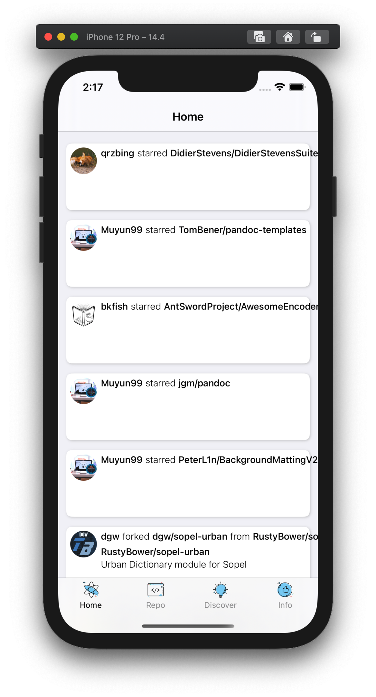
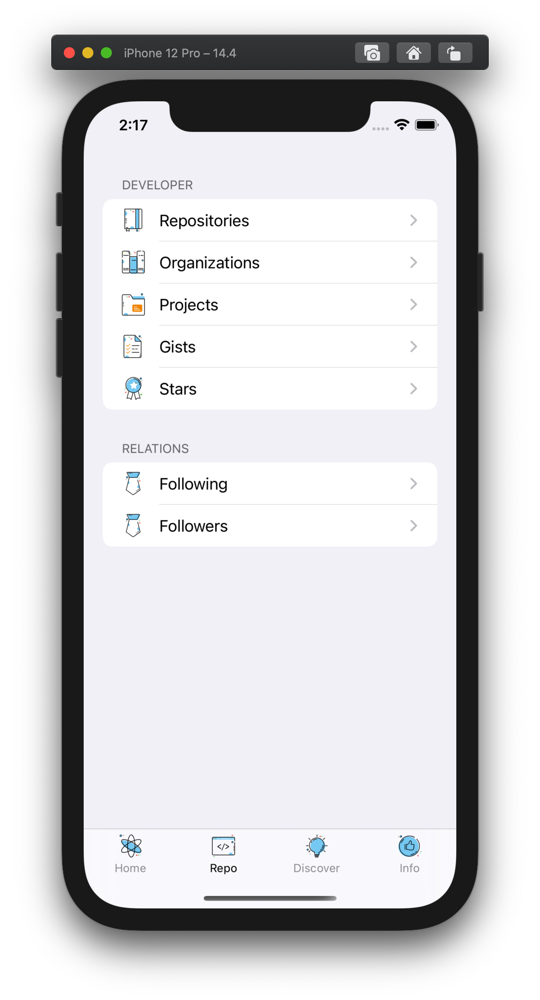
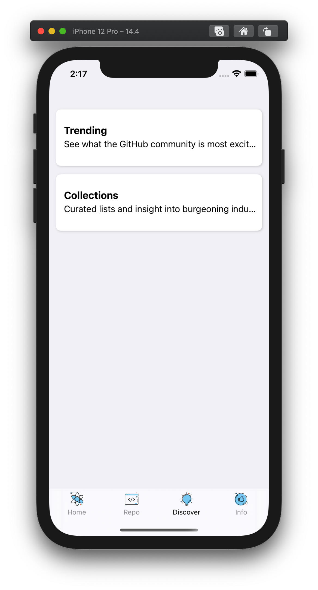
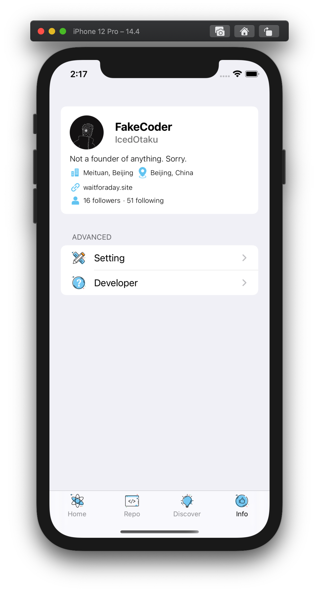

# FakeGithub

FakeGithub is an iOS application written using Objective-C. Opensource this project for learning purpose. Hope this could be a little useful for starter Objective-C developer.

## TODO

- [x] Github OAuth Application
- [x] Github REST API Interface
- [x] Local data storage
- [x] Personal feed information
- [x] Trending UI implement
- [x] Collection UI implement
- [ ] better UI implement
- [ ] Setting functions
- [ ] Dark mode support
- [ ] Adaption on different iPhones

## References

- [Github OAuth Application](https://docs.github.com/cn/developers/apps/authorizing-oauth-apps)
- [Github REST API](https://docs.github.com/en/rest)

## Screenshot

